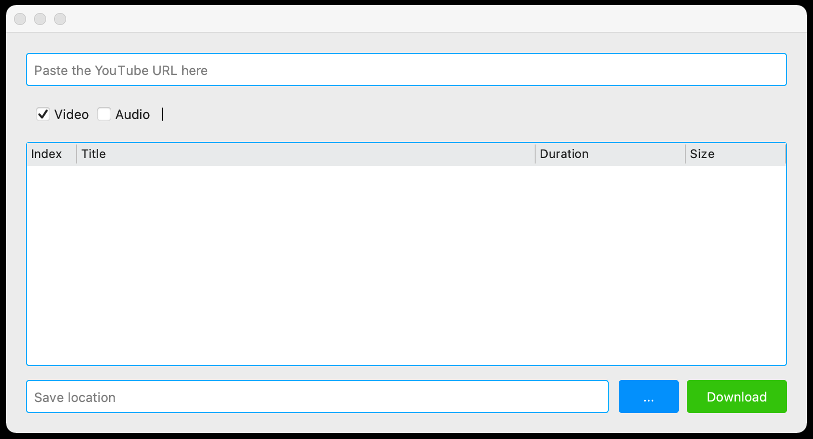

# YODO

YODO: YouTube Downloader is an easy-to-use tool for downloading video and audio files. It is possible to download one 
or more files at the same time.


## Installation
```bash
pip install -r requirements.txt
```

## How To Use

1. Run the script
2. Copy the YouTube URL and paste into the field. It automaticly reads the data and puts it into the list. You can 
put more than one URL into the list.
3. Find a location where you want to save the files.
4. Check the box next to video or audio files.
5. Press Download and wait.

## View


## Author
Alan Graf

- [Instagram](https://www.instagram.com/noxcoder/)
- [Github](https://github.com/alangraf)
